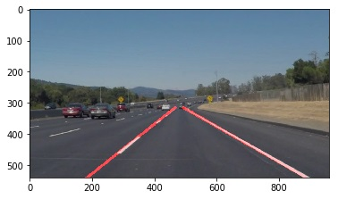

# **Finding Lane Lines on the Road**

## **The goals / steps of this project are the following:**
* Make a pipeline that finds lane lines on the road
* Reflect on your work in a written report

---

## Reflection

### **1. My pipeline:**
1. Apply grayscale transform to convert images to gray images
2. Apply a Gaussian Noise kernel to smooth images, and apply Canny transfer to detect edges.
3. Select region of interest and mask other areas of the images.
4. Apply Hough Transform to detect lane lines.
5. Superimpose the lane lines on the original images.

**In order to draw a single line on the left and right lanes, I modified the draw_lines() function by 3 steps:**

1. Calculated slope with coordinates of vertices. Then based on the slope, sort it into right or left lane line.
2. Calculate the average slopes.
3. Use the average slopes and suitable Y coordinates, based on Region of Interest, figure out the X coordinates. 
(y1-y2) = k (x1-x2)

### **2. Identify potential shortcomings with my current pipeline:**

1. The region of interest in image masking is static, it can only detect the line in specific area of the video.
2. Slope conditions used for detecting right and left lanes do not work in case of a curve in the road.
3. Slope is not stable by detecting dashed lane lines.

### **3. Suggest possible improvements to your pipeline:**

1. Try to make a dynamic image masking, so that it could work in different scenarios.
2. Continue to modify the slopes, in order to get better performance by curve.
3. A possible improvement would be to change the parameters to overcome some situations.
4. Try to write another code, which use cv2 to read the images, and make a comparation with the results of the code used matplotlib.image. 